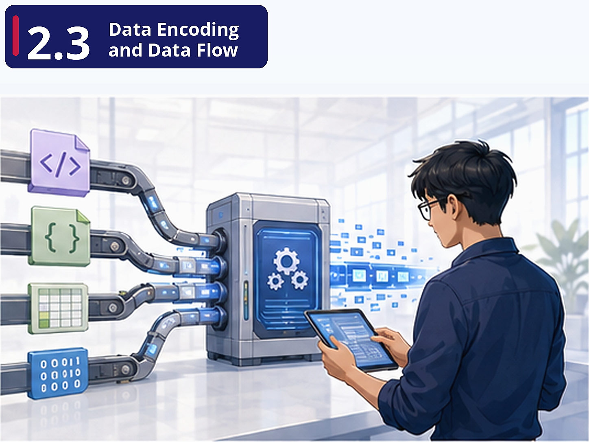

# Pre-class Brief

## Where are we?

You've been tasked with connecting FreshCart's systems. The logistics partner sends data as XML. The mobile app sends JSON. The legacy inventory system uses CSV exports. You need to move data between these systems, but they all speak different formats. And it's not just about *format* — it's about *efficiency*. When you're sending millions of records, the difference between JSON (human-readable, large) and Parquet (binary, compact, columnar) matters enormously.

## Why this matters

Data encoding is the lingua franca of data engineering. Every pipeline you build will require reading data in one format and writing it in another. Understanding *why* Parquet is the standard for analytics (columnar, compressed, schema-embedded) versus why JSON dominates APIs (human-readable, self-describing) prevents you from making costly format choices. The data flow concepts (REST, RPC, message queues) define how systems communicate.

## Key concepts

**Columnar vs Row-Based Storage** — Parquet/ORC vs JSON/CSV. FreshCart's analytics queries typically scan a few columns across millions of rows. Parquet's columnar format means you read only the columns you need, resulting in dramatically faster queries and lower costs. This is why BigQuery, Snowflake, and Spark all default to Parquet.

**Schema Evolution and Compatibility** — Real-world data changes. FreshCart will add fields to its order schema, rename columns, deprecate attributes. Avro's reader/writer schema model and Protobuf's field tags both solve this problem differently. Understanding schema evolution prevents the "we changed one field and broke every downstream pipeline" disaster.

**Synchronous vs Asynchronous Data Flow** — REST APIs are request-response: you ask, you wait, you get an answer. Message queues are fire-and-forget: you publish a message, and consumers process it when ready. FreshCart's checkout system needs synchronous calls (confirm payment now). Sending order events to analytics can be asynchronous. Choosing the wrong pattern causes either unnecessary latency or unreliable delivery.

